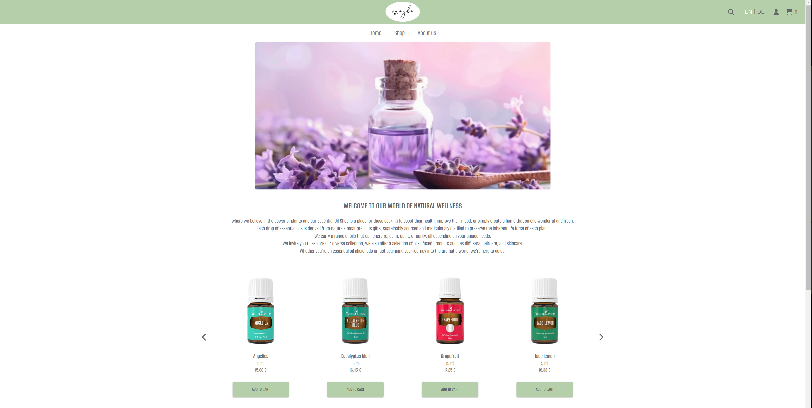
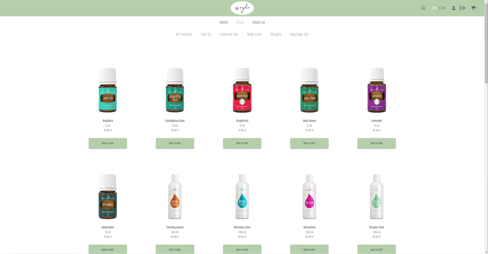
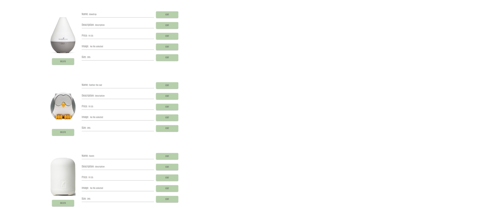

# Webshop Portfolio Application

E-commerce platform with the followed functionalities and technologies

## Live on 

 [https://oylo.netlify.app](https://oylo.netlify.app)

## Technologies Stack

- **Backend**: Node / Express / JavaScript
- **Frontend**: Vite / React / TypeScript / Sass
- **Tests**: Vitest / React Testing Library 
- **File Storage**: AWS S3
- **Database**: PostgreSQL
- **ORM**: Sequelize

## Functionalities

### Translation

The application supports multiple languages, currently including:

- English
- German

### Responsive Design

The application is designed to be fully responsive and works seamlessly across various devices and screen sizes.

### Login System

A secure login system with role-based access control.

### User Roles

- **Admin**: Can perform CRUD operations on users and products.
- **Customer**: Registered users can manage their personal data and perform operations available to them.

## Screenshots

### Homepage



### Shop page



### Product Listing




## 📦 Setup and Installation

1. Clone the repository:
   ```sh
   git clone https://github.com/amafigu/oil-shop.git
   ```

2. Navigate to the project directory:
   ```sh
   cd oil-shop
   ```


3. Install frontend dependencies:
   ```sh
   cd frontend 
   npm install
   ```
4. Run the application:
   ```sh
   npm start
   ```